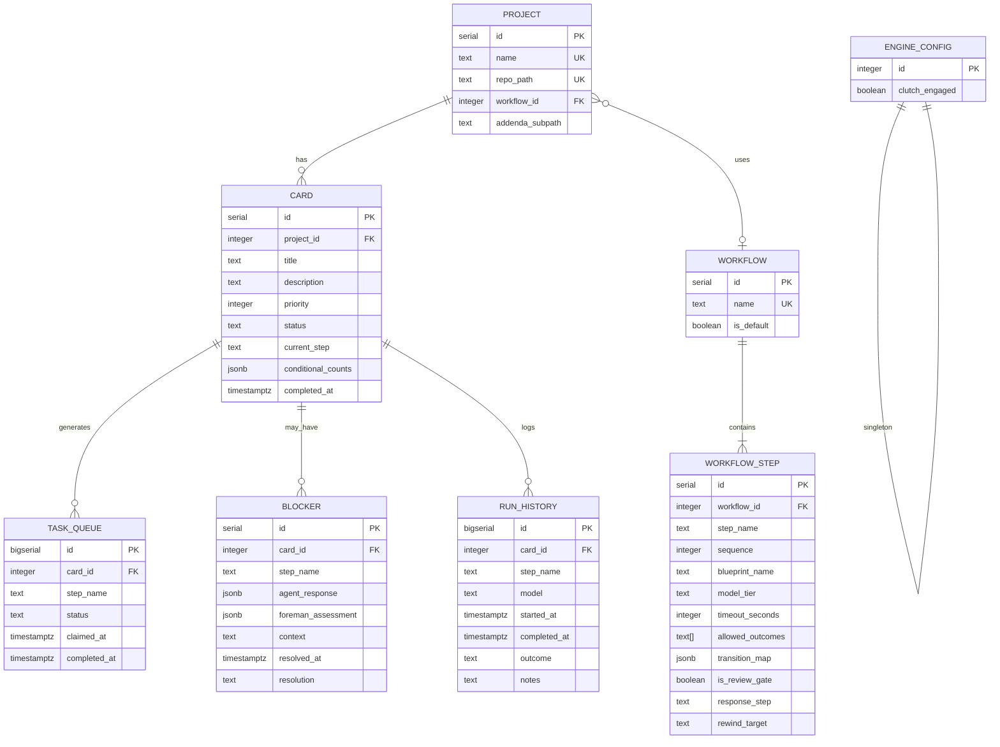

# Build Nightshift Autonomous Dev Engine

## Enhancement Summary

**Deepened on:** 2026-04-06
**Agents used:** Architecture strategist, data integrity guardian, performance oracle,
security sentinel, pattern recognition specialist, code simplicity reviewer,
best practices researcher, agent-native architecture reviewer

### Key Improvements
1. Per-review-gate conditional counts (JSONB) replacing flat card-level counter — prevents 9-loop bug
2. Security hardening: `ProcessStartInfo.ArgumentList`, env var whitelist for child processes, Serilog secret redaction
3. CliWrap for subprocess management — prevents stdout/stderr deadlock
4. Generic Host (`BackgroundService`) for graceful shutdown with `CancellationToken`
5. `NpgsqlDataSource` (modern pooled API) replacing raw connection management
6. Explicit transaction boundaries documented for all state-mutating operations
7. Missing model classes added (Card, Project, Blocker, RunHistoryEntry)
8. FK indexes added (Postgres doesn't auto-create them)
9. Shared agent scratchpad (`notes.md` per card) for inter-agent knowledge transfer
10. Richer Foreman outcome space with `inject_context` field

### New Considerations Discovered
- `.NET subprocess deadlock`: must read stdout/stderr async or use CliWrap
- `Npgsql autocommit default`: explicit transactions required for SKIP LOCKED
- `ARG_MAX` ceiling: blueprint + addenda > 128KB will fail subprocess spawn
- Autovacuum tuning needed on task_queue (high dead tuple rate)

## Overview

Build the complete Nightshift engine: a C#/.NET 10 console app that pulls
cards off a Postgres kanban board, walks them through an SDLC agent pipeline
via Claude CLI subprocesses, and delivers merged PRs. The engine is
deterministic — no LLM in the orchestrator. All intelligence lives in the
agents.

Prior art: OGRE engine (Python state machine, `/workspace/EtlReverseEngineering`)
and LeoBloom pipeline (manual SDLC orchestration, `/workspace/LeoBloom`).

## Problem Statement / Motivation

BD currently orchestrates the LeoBloom pipeline manually — spawning agents,
following workflow.md, passing artifacts between steps. This is mechanical
work that doesn't require judgment. It's bottlenecked by BD's context window
and Dan's availability. Nightshift automates the mechanical parts and isolates
the judgment calls into a blocker protocol that Dan resolves on his schedule.

## Proposed Solution

Port OGRE's engine patterns (transition tables, task queue, agent subprocess
invocation, retry logic, clutch) to C# and wire them to an SDLC pipeline
derived from LeoBloom's workflow. DB-driven workflows allow per-project
customization. The Foreman agent handles judgment calls within defined
jurisdiction; everything else escalates to Dan.

## Security Assumptions

All registered projects and their addenda files are fully trusted. Nightshift
must never be pointed at untrusted repositories. The threat model assumes
Dan/BD are the only operators with DB access. Addenda in target repos are
trusted because all repos are Dan's personal projects.

## Technical Approach

### Architecture

```
+------------------+     +-------------------+     +------------------+
|   Kanban Board   |     |  Workflow Engine   |     |  Agent Runtime   |
|   (Postgres)     |<--->|  (C# Console App) |---->|  (Claude CLI)    |
|                  |     |                   |     |                  |
|  - Cards         |     |  - Outer loop     |     |  - Fresh context |
|  - Projects      |     |  - Inner loop     |     |  - Blueprint +   |
|  - Workflows     |     |  - Card claiming  |     |    addenda       |
|  - Blockers      |     |  - Foreman calls  |     |  - JSON response |
|  - Run history   |     |  - Clutch check   |     |  - Artifact I/O  |
+------------------+     +-------------------+     +------------------+
```

### Key Design Decisions (see brainstorm: docs/brainstorm.md)

- **Single-threaded.** One card at a time. Full pipeline per card before polling next.
- **Batch CLI.** Manual start, runs until drained or all blocked. Clutch = graceful stop.
- **Foreman on every CONDITIONAL/FAIL.** 3-loop hard cap per review gate enforced by engine.
- **RTE bookends.** Creates branch at start, merges PR at end. Engine is git-ignorant.
- **DB-driven workflows.** Default is BDD pipeline. Per-project full override.
- **Process artifacts on filesystem (gitignored).** Code/specs in target repo.

### Spec-Flow Gaps Resolved

The brainstorm left several error-handling and edge-case gaps. This plan
resolves them with patterns from OGRE:

| Gap | Resolution |
|-----|-----------|
| Card claiming safety | Separate `task_queue` table with `SELECT FOR UPDATE SKIP LOCKED` + unique active-task constraint (OGRE pattern). Claim-and-update wrapped in explicit `NpgsqlTransaction`. |
| Crash recovery | On startup, detect orphaned IN_PROGRESS cards. Log warning, re-enqueue current step. Agents must be idempotent for their step (RTE checks if branch exists before creating). |
| `FAILED` card status | Cut it. Cards are either COMPLETE or BLOCKED. Engine errors that exhaust retries → BLOCKED with engine-error blocker. |
| Foreman response contract | JSON: `{"outcome": "RETRY\|ESCALATE", "reason": "...", "notes": "...", "inject_context": "..."}`. `inject_context` is optional text injected into the next agent's prompt. Garbage JSON → auto-escalate. |
| Transition map vs hardcoded Foreman | Foreman routing is engine-level, not in transition_map. Transition maps cover happy-path outcomes only. Engine intercepts CONDITIONAL/FAIL/JUDGMENT_NEEDED before consulting the map. This is a deliberate departure from OGRE — the Foreman is a first-class engine concept, not a workflow step. |
| Agent subprocess timeout | 30 minutes default (matches OGRE). Configurable per workflow step via optional `timeout_seconds` column. |
| Prior artifacts to agents | File paths in the prompt. Agent reads from `artifacts/{card_id}/process/` for prior step outputs and `{repo_path}` for code/specs. Same pattern as OGRE. |
| Agent working directory | Target repo's `repo_path`. Agents operate in the repo they're building. Validated at project registration: must be absolute, under `/workspace/`, no `..` traversal. |
| `builder_response` | A real workflow step with its own entry in `workflow_step`. Uses the builder blueprint but gets the reviewer's feedback injected into the prompt. Feedback source: the prior step's process artifact (reviewer's JSON response). |
| `allowed_outcomes` validation | Engine validates agent outcome against step's `allowed_outcomes`. Unknown outcome → routes to Foreman for interpretation (not auto-fail). |
| Run history cleanup trigger | Engine runs cleanup at startup. `DELETE FROM run_history WHERE card_id IN (SELECT id FROM card WHERE completed_at < now() - interval '30 days')`. Batched in chunks of 1000. |
| Stale artifact cleanup on rewind | Engine deletes process artifacts for downstream steps when Foreman triggers a retry (port OGRE's `_cleanup_stale_artifacts`). |
| Workflow validation at startup | Engine validates all workflow transition maps on boot. Checks: every step reachable, no dangling references, terminal step exists, blueprints exist on disk, review gates have non-NULL `response_step` and `rewind_target`, non-review-gates have NULL for both. |
| `model_tier` mapping | Engine maps tier names to model IDs via config dictionary. Default: opus → claude-opus-4-6, sonnet → claude-sonnet-4-6, haiku → claude-haiku-4-5-20251001. Overridable via env vars. |
| Clutch semantics | Clutch disengaged = finish current step and EXIT (not pause). This is intentional — Dan kicks off the engine manually each time. Re-engaging the clutch in DB before restart allows resumption. |
| Transaction boundaries | All state-mutating operations are atomic. Claiming: SELECT FOR UPDATE + UPDATE status in one transaction. Advancing: UPDATE card + INSERT next task + UPDATE old task = one transaction. Blocking: UPDATE card + INSERT blocker + UPDATE task = one transaction. `StepHandler` owns the transaction, not individual repositories. |
| Subprocess management | Use `CliWrap` NuGet package for async subprocess invocation. Prevents stdout/stderr buffer deadlock. Supports `CancellationToken` for timeout. Kills entire process tree on cancellation. |
| Child process environment | Whitelist env vars before spawning agents: `PATH`, `HOME`, `GIT_SSH_COMMAND`, `ANTHROPIC_API_KEY`. Strip DB credentials and other engine-only secrets. |

### Implementation Phases

#### Phase 1: Project Scaffolding + Database

**Deliverables:**
- C# solution with console app project (`Nightshift.Engine`) using Generic Host
- Postgres database `nightshift` with dedicated role
- Full DDL schema with indexes and constraints
- Serilog logging configured (console + rolling file, Npgsql override to Warning)
- `Program.cs` using `Host.CreateApplicationBuilder` + `BackgroundService`

**Schema (refined from brainstorm + spec-flow + deepening review):**

```sql
-- Nightshift schema
CREATE SCHEMA IF NOT EXISTS nightshift;

-- Projects
CREATE TABLE nightshift.project (
    id              serial          PRIMARY KEY,
    name            text            NOT NULL UNIQUE,
    repo_path       text            NOT NULL UNIQUE,
    workflow_id     integer,        -- nullable FK, null = default workflow
    addenda_subpath text            NOT NULL DEFAULT 'DSWF',
    created_at      timestamptz     NOT NULL DEFAULT now()
);

-- Workflows
CREATE TABLE nightshift.workflow (
    id              serial          PRIMARY KEY,
    name            text            NOT NULL UNIQUE,
    is_default      boolean         NOT NULL DEFAULT false
);

-- Only one default workflow allowed
CREATE UNIQUE INDEX ix_workflow_one_default
    ON nightshift.workflow (is_default)
    WHERE is_default = true;

-- Workflow steps
CREATE TABLE nightshift.workflow_step (
    id              serial          PRIMARY KEY,
    workflow_id     integer         NOT NULL REFERENCES nightshift.workflow(id),
    step_name       text            NOT NULL,
    sequence        integer         NOT NULL CHECK (sequence > 0),
    blueprint_name  text            NOT NULL,
    model_tier      text            NOT NULL DEFAULT 'sonnet'
                    CHECK (model_tier IN ('opus', 'sonnet', 'haiku')),
    timeout_seconds integer         NOT NULL DEFAULT 1800 CHECK (timeout_seconds > 0),
    allowed_outcomes text[]         NOT NULL,
    transition_map  jsonb           NOT NULL,  -- {"SUCCESS": "next_step", ...}
    is_review_gate  boolean         NOT NULL DEFAULT false,
    response_step   text,           -- step to route to on Foreman RETRY
    rewind_target   text,           -- step to rewind to on full FAIL
    UNIQUE (workflow_id, step_name)
);

CREATE INDEX ix_workflow_step_workflow ON nightshift.workflow_step (workflow_id);

-- Cards
CREATE TABLE nightshift.card (
    id              serial          PRIMARY KEY,
    project_id      integer         NOT NULL REFERENCES nightshift.project(id),
    title           text            NOT NULL,
    description     text            NOT NULL,
    priority        integer         NOT NULL DEFAULT 3 CHECK (priority BETWEEN 1 AND 5),
    status          text            NOT NULL DEFAULT 'queued'
                    CHECK (status IN ('queued', 'in_progress', 'blocked', 'complete')),
    current_step    text,
    conditional_counts jsonb        NOT NULL DEFAULT '{}',  -- {"reviewer": 1, "governor": 0}
    created_at      timestamptz     NOT NULL DEFAULT now(),
    updated_at      timestamptz     NOT NULL DEFAULT now(),
    completed_at    timestamptz
);

CREATE INDEX ix_card_project ON nightshift.card (project_id);
CREATE INDEX ix_card_status ON nightshift.card (status, priority, created_at);
CREATE INDEX ix_card_completed ON nightshift.card (completed_at)
    WHERE completed_at IS NOT NULL;

-- Task queue (OGRE pattern: separate from card lifecycle)
CREATE TABLE nightshift.task_queue (
    id              bigserial       PRIMARY KEY,
    card_id         integer         NOT NULL REFERENCES nightshift.card(id),
    step_name       text            NOT NULL,
    status          text            NOT NULL DEFAULT 'pending'
                    CHECK (status IN ('pending', 'claimed', 'complete', 'failed')),
    created_at      timestamptz     NOT NULL DEFAULT now(),
    claimed_at      timestamptz,
    completed_at    timestamptz
);

-- FIFO index for pending tasks
CREATE INDEX ix_task_queue_fifo
    ON nightshift.task_queue (created_at)
    WHERE status = 'pending';

-- One active task per card
CREATE UNIQUE INDEX ix_task_queue_one_active
    ON nightshift.task_queue (card_id)
    WHERE status IN ('pending', 'claimed');

CREATE INDEX ix_task_queue_card ON nightshift.task_queue (card_id);

-- Tune autovacuum for high-churn queue table
ALTER TABLE nightshift.task_queue SET (
    autovacuum_vacuum_scale_factor = 0.01,
    autovacuum_analyze_scale_factor = 0.005
);

-- Blockers
CREATE TABLE nightshift.blocker (
    id              serial          PRIMARY KEY,
    card_id         integer         NOT NULL REFERENCES nightshift.card(id),
    step_name       text            NOT NULL,
    agent_response  jsonb,
    foreman_assessment jsonb,
    context         text,
    created_at      timestamptz     NOT NULL DEFAULT now(),
    resolved_at     timestamptz,
    resolution      text,
    CHECK ((resolved_at IS NULL) = (resolution IS NULL))
);

CREATE INDEX ix_blocker_card ON nightshift.blocker (card_id);
CREATE INDEX ix_blocker_unresolved
    ON nightshift.blocker (card_id)
    WHERE resolved_at IS NULL;

-- Run history
CREATE TABLE nightshift.run_history (
    id              bigserial       PRIMARY KEY,
    card_id         integer         NOT NULL REFERENCES nightshift.card(id),
    step_name       text            NOT NULL,
    model           text            NOT NULL,
    started_at      timestamptz     NOT NULL DEFAULT now(),
    completed_at    timestamptz,
    outcome         text,
    notes           text
);

CREATE INDEX ix_run_history_card ON nightshift.run_history (card_id);
CREATE INDEX ix_run_history_card_step ON nightshift.run_history (card_id, step_name);

-- Engine config (singleton)
CREATE TABLE nightshift.engine_config (
    id              integer         PRIMARY KEY DEFAULT 1 CHECK (id = 1),
    clutch_engaged  boolean         NOT NULL DEFAULT true,
    updated_at      timestamptz     NOT NULL DEFAULT now()
);

INSERT INTO nightshift.engine_config (id) VALUES (1) ON CONFLICT DO NOTHING;

-- Foreign keys for project -> workflow
ALTER TABLE nightshift.project
    ADD CONSTRAINT fk_project_workflow
    FOREIGN KEY (workflow_id) REFERENCES nightshift.workflow(id);
```

**Key schema changes from deepening review:**
- `project.repo_path` is now UNIQUE (prevents two projects on same repo)
- `conditional_counts` is now JSONB on card (per-review-gate, like OGRE)
- `blocker.agent_response` and `foreman_assessment` are now JSONB (structured agent data)
- `blocker` has resolved-state consistency CHECK constraint
- `model_tier` has CHECK constraint against allowed values
- `sequence` and `timeout_seconds` have CHECK > 0
- `task_queue.status` uses `'complete'` not `'completed'` (matches card convention)
- `ix_workflow_one_default` unique partial index prevents multiple default workflows
- FK indexes added on all FK columns (Postgres does NOT auto-create these)
- `ix_blocker_unresolved` partial index for morning conversation queries
- `ix_card_completed` partial index for run history cleanup
- `ix_run_history_card_step` composite index for prior artifact lookups
- Autovacuum tuning on `task_queue` for high dead tuple rate

**ERD:**



**Files:**
- `Nightshift.sln`
- `src/Nightshift.Engine/Nightshift.Engine.csproj`
- `src/Nightshift.Engine/Program.cs`
- `src/Nightshift.Engine/appsettings.json` (non-secret config: log paths, model tier map)
- `sql/001_create_schema.sql`
- `sql/002_seed_default_workflow.sql`

**NuGet packages:**
- `Npgsql` (Postgres driver)
- `Npgsql.DependencyInjection` (registers `NpgsqlDataSource` as singleton in DI)
- `Microsoft.Extensions.Hosting` (Generic Host, `BackgroundService`, `CancellationToken` shutdown)
- `Serilog`, `Serilog.Sinks.Console`, `Serilog.Sinks.File`, `Serilog.Extensions.Hosting`
- `Serilog.Enrichers.Thread`, `Serilog.Enrichers.Environment`
- `CliWrap` (async subprocess management — prevents stdout/stderr deadlocks)
- `System.Text.Json` (built-in, for JSON parsing)

### Research Insights — .NET Patterns

**NpgsqlDataSource (modern pooled API):**
- Create ONE `NpgsqlDataSource` for the app lifetime. It owns the connection pool internally.
- Configure: `MinPoolSize=1`, `MaxPoolSize=5`, `MaxAutoPrepare=50` (auto-prepares the polling query after a few executions).
- Override Npgsql log level to Warning — it's chatty at Info and will flood the log in a polling loop.

**Generic Host for console apps:**
- Use `Host.CreateApplicationBuilder` + `BackgroundService` even for a batch CLI app.
- Gives you `CancellationToken`-based shutdown, DI, and Serilog integration for free.
- `SIGINT` (Ctrl+C) and `SIGTERM` both trigger graceful shutdown automatically.
- Extend `ShutdownTimeout` to 60s (default 5s is too short for agent steps).

**CliWrap for subprocess invocation:**
- Replaces raw `Process.Start()` which has a classic deadlock: if stdout buffer fills while reading stderr synchronously, the process hangs forever.
- CliWrap reads both streams concurrently, supports `CancellationToken`, and kills the entire process tree on cancellation.
- Use `ExecuteBufferedAsync()` for capturing output, `WithValidation(CommandResultValidation.None)` to handle non-zero exit codes ourselves.

**Transaction pattern for SKIP LOCKED claiming:**
```csharp
await using var conn = await dataSource.OpenConnectionAsync(ct);
await using var tx = await conn.BeginTransactionAsync(ct);
// SELECT FOR UPDATE SKIP LOCKED + UPDATE status in same transaction
// Npgsql defaults to autocommit — explicit tx is REQUIRED
await tx.CommitAsync(ct);
```

---

#### Phase 2: Engine Core — Outer Loop + Card Claiming

**Deliverables:**
- `EngineWorker` class (extends `BackgroundService`): outer loop with clutch check, card polling, graceful exit via `CancellationToken`
- `CardRepository` class: card CRUD, status updates, step advancement
- `TaskQueueRepository` class: enqueue, claim, complete, fail operations
- Crash recovery: detect orphaned claimed tasks on startup, re-enqueue them
- Run history cleanup on startup (batched in chunks of 1000)

**Key classes:**

```
EngineWorker : BackgroundService
  - ExecuteAsync(CancellationToken) → main outer loop
  - CheckClutch() → query engine_config, treat missing row as disengaged (fail-safe)

CardRepository
  - GetNextAvailableCard() → JOIN card + task_queue, ORDER BY priority, created_at
  - UpdateStatus(cardId, status)
  - AdvanceStep(cardId, nextStep, NpgsqlTransaction)
  - MarkComplete(cardId, NpgsqlTransaction)
  - MarkBlocked(cardId, NpgsqlTransaction)

TaskQueueRepository
  - Enqueue(cardId, stepName, NpgsqlTransaction)
  - ClaimNext() → SELECT FOR UPDATE SKIP LOCKED (explicit transaction)
  - Complete(taskId, NpgsqlTransaction)
  - Fail(taskId, NpgsqlTransaction)
  - RecoverOrphaned() → find claimed tasks, re-enqueue as pending
```

**Note:** Repository methods that mutate state accept an `NpgsqlTransaction` parameter.
`StepHandler` (Phase 6) owns the transaction and passes it down. Repositories
do not create their own transactions.

**Card polling query (UPDATE...RETURNING pattern for atomic claim):**
```sql
UPDATE nightshift.task_queue
SET status = 'claimed', claimed_at = now()
WHERE id = (
    SELECT tq.id
    FROM nightshift.task_queue tq
    JOIN nightshift.card c ON c.id = tq.card_id
    WHERE tq.status = 'pending'
      AND c.status IN ('queued', 'in_progress')
    ORDER BY c.priority ASC, tq.created_at ASC
    FOR UPDATE OF tq SKIP LOCKED
    LIMIT 1
)
RETURNING id, card_id, step_name;
```

**Files:**
- `src/Nightshift.Engine/Engine/EngineWorker.cs`
- `src/Nightshift.Engine/Data/CardRepository.cs`
- `src/Nightshift.Engine/Data/TaskQueueRepository.cs`
- `src/Nightshift.Engine/Data/EngineConfigRepository.cs`
- `src/Nightshift.Engine/Models/Card.cs`
- `src/Nightshift.Engine/Models/Project.cs`

---

#### Phase 3: Workflow System

**Deliverables:**
- `WorkflowRepository` class: load workflow + steps for a project
- `WorkflowStep` model: step definition with transition map, review gate config
- `Workflow` model
- Workflow validation at startup
- Default BDD workflow seed data

**Transition resolution logic:**
```
1. Agent returns outcome
2. Validate outcome is in step.allowed_outcomes → if not, route to Foreman
3. If outcome is CONDITIONAL or FAIL → route to Foreman (engine-level)
4. If outcome is JUDGMENT_NEEDED → route to Foreman (engine-level)
5. If outcome is in step.transition_map → return next step name
6. If transition_map returns "COMPLETE" → card is done
```

**Review gate fields on workflow_step:**
- `is_review_gate`: true for reviewer, governor, etc.
- `response_step`: the builder_response step to route to on Foreman RETRY
- `rewind_target`: the step to fully rewind to on repeated FAIL

**Workflow validation checks (at startup):**
- Every step reachable from the first step via transitions
- No dangling step name references in `transition_map`, `response_step`, `rewind_target`
- Terminal step exists (a step with a transition to "COMPLETE")
- Blueprints exist on disk for every step
- Review gates have non-NULL `response_step` and `rewind_target`
- Non-review-gate steps have NULL for both

**Default workflow seed (sql/002_seed_default_workflow.sql):**

| step_name | seq | blueprint | model | outcomes | transitions | review_gate | response | rewind |
|-----------|-----|-----------|-------|----------|-------------|-------------|----------|--------|
| rte_setup | 1 | rte | sonnet | SUCCESS, FAIL | SUCCESS→po_kickoff | no | — | — |
| po_kickoff | 2 | po | opus | SUCCESS, FAIL | SUCCESS→planner | no | — | — |
| planner | 3 | planner | opus | SUCCESS, FAIL | SUCCESS→gherkin_writer | no | — | — |
| gherkin_writer | 4 | gherkin-writer | sonnet | SUCCESS, FAIL | SUCCESS→builder | no | — | — |
| builder | 5 | builder | sonnet | SUCCESS, FAIL | SUCCESS→qe | no | — | — |
| qe | 6 | qe | sonnet | SUCCESS, FAIL | SUCCESS→reviewer | no | — | — |
| reviewer | 7 | reviewer | opus | APPROVED, CONDITIONAL, FAIL | APPROVED→governor | yes | builder_response | builder |
| builder_response | 8 | builder | sonnet | SUCCESS, FAIL | SUCCESS→reviewer | no | — | — |
| governor | 9 | governor | opus | APPROVED, CONDITIONAL, FAIL | APPROVED→po_signoff | yes | builder_response | builder |
| po_signoff | 10 | po | opus | APPROVED, FAIL | APPROVED→rte_merge | no | — | — |
| rte_merge | 11 | rte | sonnet | SUCCESS, FAIL | SUCCESS→COMPLETE | no | — | — |

**Files:**
- `src/Nightshift.Engine/Data/WorkflowRepository.cs`
- `src/Nightshift.Engine/Models/WorkflowStep.cs`
- `src/Nightshift.Engine/Models/Workflow.cs`
- `src/Nightshift.Engine/Engine/WorkflowValidator.cs`
- `sql/002_seed_default_workflow.sql`

---

#### Phase 4: Agent Runtime

**Deliverables:**
- `AgentInvoker` class: build CLI command via CliWrap, spawn subprocess, capture output
- `PromptBuilder` class: assemble prompt from card, prior artifacts, addenda, scratchpad
- `OutcomeParser` class: parse JSON response, extract outcome, handle failures
- `ArtifactManager` class: read/write process artifacts, manage scratchpad, cleanup on rewind
- Model tier mapping (config dictionary)

**Agent invocation pattern (port of OGRE's AgentNode):**
```
1. Load blueprint from blueprints/{blueprint_name}.md
2. Check for addendum at {repo_path}/{addenda_subpath}/{blueprint_name}.md
   (validate paths: no ".." traversal, must be under /workspace/)
3. Concatenate blueprint + addendum (if exists) → system prompt
4. Build prompt:
   - Card title + description
   - Prior step artifacts (file paths to artifacts/{card_id}/process/)
   - Card scratchpad (artifacts/{card_id}/notes.md — read/append by agents)
   - For builder_response: reviewer's feedback from prior step's process artifact
   - If Foreman provided inject_context: include it
   - Instructions to return JSON with "outcome" field
   - Instructions to append observations to notes.md for downstream agents
5. Invoke via CliWrap:
   - Command: "claude"
   - ArgumentList: ["-p", "--append-system-prompt", <text>, "--output-format",
     "json", "--model", <model_id>, "--dangerously-skip-permissions",
     "--no-session-persistence", <prompt>]
   - WorkingDirectory: repo_path
   - Environment: WHITELISTED env vars only (PATH, HOME, GIT_SSH_COMMAND,
     ANTHROPIC_API_KEY — strip DB creds and other engine secrets)
   - Timeout via CancellationToken: step.timeout_seconds
6. Parse response:
   a. Try reading process artifact file (artifacts/{card_id}/process/{step_name}.json)
   b. Fallback: parse stdout as JSON
   c. Extract "outcome" field, map to enum
   d. If parsing fails entirely → FAIL outcome
7. Save full agent response as process artifact
```

**Outcome enum:**
```csharp
public enum AgentOutcome
{
    Success,
    Fail,
    Approved,
    Conditional,
    JudgmentNeeded
}
```

**Security requirements (from security review):**
- **MANDATORY:** Use CliWrap's argument list (or `ProcessStartInfo.ArgumentList`), NEVER string concatenation for CLI args. Prevents command injection via card titles.
- **MANDATORY:** Whitelist child process environment variables. Agents must not inherit DB credentials.
- **MANDATORY:** Never set `UseShellExecute = true`.
- Validate `blueprint_name` matches `[a-zA-Z0-9_-]+` (no path separators).
- Log the full invocation command (minus secrets) for forensics.
- Be aware of `ARG_MAX` (~128KB per argument on Linux). If blueprints + addenda grow large, switch to piping via stdin or temp file.

**Files:**
- `src/Nightshift.Engine/Agents/AgentInvoker.cs`
- `src/Nightshift.Engine/Agents/PromptBuilder.cs`
- `src/Nightshift.Engine/Agents/OutcomeParser.cs`
- `src/Nightshift.Engine/Agents/ArtifactManager.cs`
- `src/Nightshift.Engine/Models/AgentOutcome.cs`
- `src/Nightshift.Engine/Models/AgentResponse.cs`

---

#### Phase 5: Foreman + Review Loops

**Deliverables:**
- Foreman invocation logic in `AgentInvoker` (Foreman is an agent, not a separate invoker — uses same subprocess code path with the foreman blueprint)
- `ReviewLoopHandler` class: manage per-gate conditional counts, 3-loop cap, rewind logic
- Blocker creation on escalation
- Stale artifact cleanup on rewind

**Foreman invocation flow:**
```
1. Engine detects CONDITIONAL, FAIL, JUDGMENT_NEEDED, or unknown outcome
2. Build Foreman prompt via PromptBuilder (special mode):
   - Card title + description
   - Which step returned the outcome
   - The agent's full response (including reason)
   - The card's conditional_counts for the current review gate
   - For CONDITIONAL: the reviewer's specific feedback
   - Jurisdiction document (from blueprints/foreman-jurisdiction.md)
3. Invoke Foreman via AgentInvoker (model: opus, blueprint: foreman-jurisdiction)
4. Parse Foreman response:
   - Expected: {"outcome": "RETRY" | "ESCALATE", "reason": "...",
                "notes": "...", "inject_context": "optional extra context for next agent"}
   - If RETRY + gate_count < 3:
     a. Increment conditional_counts[gate_step_name]
     b. Clean stale downstream process artifacts
     c. Route to step.response_step (e.g., builder_response)
     d. Pass inject_context (if provided) to next agent's prompt
   - If RETRY + gate_count >= 3:
     a. Override to ESCALATE (engine hard cap)
     b. Create blocker with "3-loop cap exceeded at {gate}" context
   - If ESCALATE:
     a. Create blocker record
     b. Mark card BLOCKED
   - If garbage JSON:
     a. Auto-escalate
     b. Blocker notes: "Foreman returned unparseable response"
```

**Per-gate conditional counter logic (ported from OGRE):**
- `card.conditional_counts` is JSONB: `{"reviewer": 1, "governor": 0}`
- On APPROVED at a review gate: reset that gate's counter to 0
- On Foreman RETRY: increment the specific gate's counter
- 3-loop cap is per gate, not per card. A card can do 3 reviewer loops AND 3 governor loops without hitting the cap incorrectly.
- On full rewind (Foreman says RETRY but routes to `rewind_target` instead of `response_step`): reset downstream gate counters (port OGRE's `_reset_downstream_conditionals`)

**Files:**
- `src/Nightshift.Engine/Engine/ReviewLoopHandler.cs`
- `src/Nightshift.Engine/Data/BlockerRepository.cs`
- `src/Nightshift.Engine/Models/Blocker.cs`

---

#### Phase 6: Inner Loop (StepHandler) — Tying It All Together

**Deliverables:**
- `StepHandler` class: the inner loop that walks a card through its pipeline
- Integrates: workflow loading, agent invocation, outcome resolution, Foreman
  routing, transition advancement, run history logging, artifact management
- This is the heart of the engine — port of OGRE's `StepHandler.__call__`

**StepHandler.ProcessCard(card) pseudocode:**
```
1. Load workflow for card's project
2. While card is not COMPLETE and not BLOCKED:
   a. Check clutch — if disengaged, save card state and exit engine
   b. Find current step in workflow
   c. Build prompt (PromptBuilder) with prior artifacts + scratchpad + inject_context
   d. Begin transaction
   e. Log run_history start
   f. Invoke agent (AgentInvoker) — OUTSIDE the transaction (long-running)
   g. Parse outcome (OutcomeParser)
   h. Begin state-mutation transaction:
      - Log run_history completion
      - If outcome in allowed_outcomes and in transition_map:
        - If next == "COMPLETE": mark card complete, complete task
        - Else: advance card to next step, complete task, enqueue next
      - If CONDITIONAL/FAIL/JUDGMENT_NEEDED/unknown:
        - Invoke ReviewLoopHandler (which calls Foreman via AgentInvoker)
        - If retry: advance to response_step, complete task, enqueue response
        - If escalate: create blocker, mark card blocked, fail task
      - Commit transaction
   i. Continue inner loop
```

**Transaction scope clarification:** The agent invocation (step f) happens
OUTSIDE any transaction — it can take up to 30 minutes. The state mutations
(step h) are wrapped in a single short transaction. This follows OGRE's
pattern: claim quickly, process outside the lock, save state atomically.

**Files:**
- `src/Nightshift.Engine/Engine/StepHandler.cs`
- `src/Nightshift.Engine/Data/RunHistoryRepository.cs`
- `src/Nightshift.Engine/Models/RunHistoryEntry.cs`

---

#### Phase 7: Blueprints + Integration + Polish

**Deliverables:**
- Copy agent blueprints from ai-dev-playbook into `blueprints/`
- Create `blueprints/foreman-jurisdiction.md` (placeholder — Dan writes content)
- Seed a test project in the DB (e.g., LeoBloom)
- `.gitignore` for `artifacts/` directory
- End-to-end smoke test with stub agent: a shell script at `test/stub-agent.sh` that returns canned JSON for each step. Queue a card, run engine with blueprint path overridden to point at the stub, verify the card walks the full pipeline to COMPLETE.
- `README.md` with usage instructions and security assumptions
- Serilog destructuring policy for secret redaction (connection string patterns)
- Wakeup file update

**Blueprint files to copy:**
```
blueprints/
  ba.md
  builder.md
  gherkin-writer.md
  governor.md
  planner.md
  po.md
  qe.md
  reviewer.md
  rte.md
  _conventions.md
  foreman-jurisdiction.md  (placeholder)
```

**Files:**
- `blueprints/*.md`
- `test/stub-agent.sh`
- `.gitignore`
- `README.md`
- `BdsNotes/wakeup-2026-04-06b.md` (or next date)

## System-Wide Impact

- **Interaction graph:** Engine → Postgres (card state, task queue, run history) → Claude CLI (agent subprocess) → target repo (code, specs). No callbacks or observers — purely sequential.
- **Error propagation:** Agent failures → OutcomeParser returns FAIL → Foreman evaluates → escalate or retry. Engine failures → uncaught exception → crash → orphaned task recovered on restart. Foreman failures → auto-escalate (garbage JSON is always safe).
- **State lifecycle risks:** Card claiming + task queue separation prevents orphaned state. Short transactions wrap state mutations only (not agent invocations). Crash between agent completion and state save → agent re-runs (must be idempotent).
- **API surface parity:** N/A — no API. Engine is a CLI tool. BD interacts via SQL.

## Acceptance Criteria

### Functional Requirements

- [ ] Engine connects to `nightshift` Postgres database with dedicated role
- [ ] Engine polls for highest-priority, oldest pending card
- [ ] Engine claims card atomically via `SELECT FOR UPDATE SKIP LOCKED` in explicit transaction
- [ ] Engine loads correct workflow (project-specific or default)
- [ ] Engine invokes Claude CLI via CliWrap with correct blueprint + addendum + prompt
- [ ] Engine parses JSON outcome from agent response
- [ ] Engine advances card through pipeline on SUCCESS/APPROVED
- [ ] Engine routes CONDITIONAL/FAIL/JUDGMENT_NEEDED/unknown to Foreman
- [ ] Foreman RETRY routes to response step with feedback + inject_context in prompt
- [ ] Foreman ESCALATE creates blocker and marks card BLOCKED
- [ ] Engine enforces 3-loop hard cap per review gate (not per card)
- [ ] Engine marks card COMPLETE when final step succeeds
- [ ] Engine checks clutch between steps; exits gracefully when disengaged
- [ ] Engine exits when queue is drained (no pending unblocked cards)
- [ ] Engine recovers orphaned tasks on startup
- [ ] Engine cleans up run_history older than 30 days on startup (batched)
- [ ] Engine validates all workflows on startup (including review gate consistency)
- [ ] Run history logged for every agent invocation
- [ ] Serilog writes structured logs to console + rolling file
- [ ] Process artifacts written to gitignored `artifacts/{card_id}/` directory
- [ ] Per-card scratchpad (`notes.md`) readable/writable by agents
- [ ] Stale artifacts cleaned on review loop rewind
- [ ] Blueprints loaded from `blueprints/` directory in Nightshift repo
- [ ] Smoke test with stub agent walks a card through full pipeline

### Non-Functional Requirements

- [ ] All DB operations use parameterized queries (no SQL injection)
- [ ] No secrets in source code or logs (connection string from env var, Serilog redaction policy)
- [ ] Agent subprocess timeout configurable per step (default 30 min)
- [ ] Engine handles agent subprocess crash (non-zero exit) gracefully
- [ ] Child process environment whitelisted (no DB creds leaked to agents)
- [ ] CLI arguments passed as list, never string-concatenated (no command injection)
- [ ] `repo_path` and `addenda_subpath` validated at startup (no path traversal)
- [ ] Graceful shutdown via `CancellationToken` (SIGINT/SIGTERM handled)

## Dependencies & Risks

| Dependency | Risk | Mitigation |
|-----------|------|-----------|
| Claude CLI available in container | Low — already working for OGRE | Verify `claude -p` works before first run |
| Postgres at 172.18.0.1:5432 | Low — already running | Connection check at startup |
| .NET 10 SDK in container | Low — confirmed available | `dotnet --version` at startup |
| Agent idempotency (especially RTE) | Medium — branch creation must handle "already exists" | RTE blueprint must check before creating |
| Foreman blueprint quality | Medium — Dan writes this separately | Placeholder ships with engine; engine handles garbage Foreman responses gracefully |
| CliWrap NuGet package | Low — well-maintained, 50M+ downloads | Pin version in .csproj |
| Blueprint + addenda size vs ARG_MAX | Low — unlikely to exceed 128KB today | Monitor; switch to stdin pipe if needed |

## Sources & References

### Origin

- **Brainstorm document:** [docs/brainstorm.md](docs/brainstorm.md) — All architectural decisions, technology choices, workflow design, and artifact strategy carried forward from collaborative Q&A.

### Internal References

- OGRE engine: `/workspace/EtlReverseEngineering/src/workflow_engine/` — transition tables, task queue, agent invocation, retry logic, clutch
- LeoBloom pipeline: `/workspace/LeoBloom/BdsNotes/workflow.md` — SDLC agent sequence, DSWF pattern
- Agent blueprints: `/workspace/ai-dev-playbook/Tooling/DansAgents/` — battle-tested role definitions
- Dan's vision doc: `/workspace/Nightshift/docs/dans_idea.md` — original architecture vision

### External References

- [Npgsql Documentation](https://www.npgsql.org/doc/basic-usage.html)
- [PostgreSQL SKIP LOCKED pattern](https://www.2ndquadrant.com/en/blog/what-is-select-skip-locked-for-in-postgresql-9-5/)
- [CliWrap — async subprocess management](https://github.com/Tyrrrz/CliWrap)
- [.NET Generic Host for console apps](https://learn.microsoft.com/en-us/dotnet/core/extensions/generic-host)
- [Serilog structured logging](https://github.com/serilog/serilog/wiki/Getting-Started)
